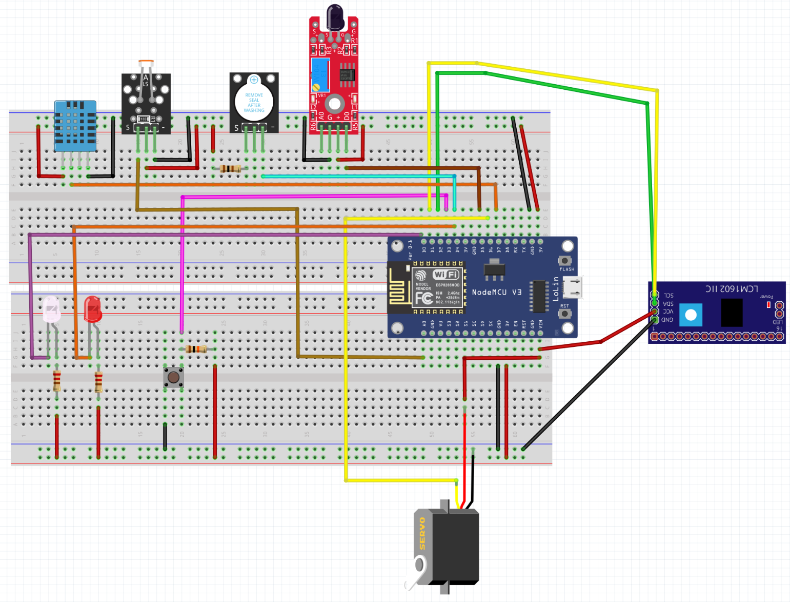

# Greenhouse 🌿
Smart greenhouse monitoring system, designed to track environmental
conditions and automate lighting while providing real-time data visualization.

## Features
- Temperature and humidity monitoring
- Automatic grow light controlled by a light sensor
- Fire detection via flame detector
- Emergency alerts with customizable thresholds
- Web dashboard for real-time monitoring
- Data logging to InfluxDB

## Hardware
- 2x LEDs
- Push button
- 3x resistors (2 for the LEDs, 1 for the button)
- DHT11 or DHT22
- Photoresistor (LDR) with a 10kΩ resistor
- Flame Sensor Module
- Active Buzzer
- Servo motor
- LCD 16x2 with I2C Adapter
- 5V Power Supply
- Jumper Wires & Breadboard
- Optional: 5V Relay Module (To toggle the Grow Light)

## Wiring


## Setup
1. Install the following libraries via Arduino IDE:
   - Adafruit Unified Sensor
   - DHT sensor library
   - ESP8266 InfluxDB
   - LiquidCrystal_I2C
2. Create a `src/Secrets.h` file to store your credentials. You can use this template:
```cpp
#ifndef SECRETS_H
#define SECRETS_H

#define SECRET_SSID "your_wifi_SSID"
#define SECRET_PASS "your_wifi_password"

#define INFLUXDB_URL "http://192.168.1.50:8086"
#define INFLUXDB_TOKEN "your-token"
#define INFLUXDB_ORG "your-org"
#define INFLUXDB_BUCKET "your-bucket"

#endif
```

## How to run
1) Connect the board to your computer using a USB cable.
2) Open the main .ino file with the Arduino IDE.
3) Select the correct board from the Arduino IDE.
4) Click Upload.
5) Open the Serial Monitor (baud rate 115200) to verify the Wi-Fi connection and data transmission.

## Future improvements
- Add dynamic thresholds' configuration via web page.
